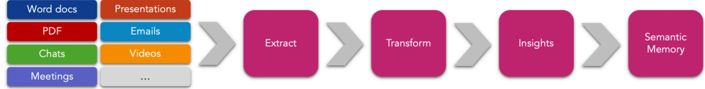
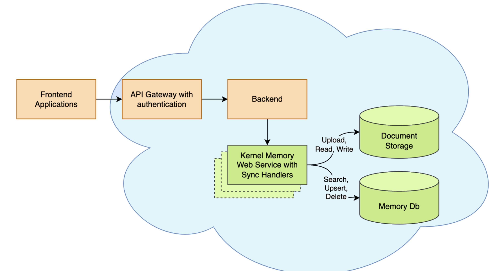
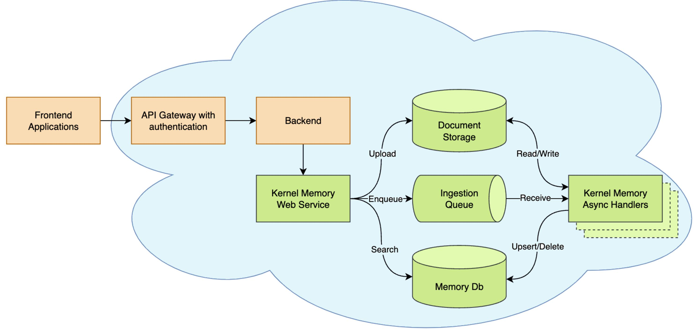

[lliicceennssee](https://github.com/microsoft/kernel-memory/blob/main/LICENSE) MIT [DDiissccoorrdd](https://aka.ms/KMdiscord) 440044 oonnlliinnee

**Kernel Memory** (KM) is a **multi-modal [AI Service](https://github.com/microsoft/kernel-memory/service/Service/README.md)** specialized in the efficient indexing of datasets through custom continuous data hybrid pipelines, with support for **[Retrieval Augmented Generation](https://en.wikipedia.org/wiki/Prompt_engineering#Retrieval-augmented_generation)** ( RAG), synthetic memory, prompt engineering, and custom semantic memory processing.

KM is available as a **Web Service**, as a **[Docker container](https://hub.docker.com/r/kernelmemory/service)**, a **[Plugin](https://learn.microsoft.com/copilot/plugins/overview)** for ChatGPT/Copilot/Semantic Kernel, and as a .NET library for embedded applications.

Utilizing advanced embeddings and LLMs, the system enables Natural Language querying for obtaining answers from the indexed data, complete with citations and links to the original sources.

Designed for seamless integration as a Plugin with [Semantic Kernel,](https://github.com/microsoft/semantic-kernel) Microsoft Copilot and ChatGPT, Kernel Memory enhances data-driven features in applications built for most popular AI platforms.

Kernel Memory works and scales at best when running as an asynchronous **Web Service**, allowing to ingest thousands of documents and information without blocking your app.

However, Kernel Memory can also run in serverless mode, embedding MemoryServerless class instance in .NET backend/console/desktop apps in synchronous mode. This approach works as well as in ASP.NET Web APIs and Azure Functions. Each request is processed immediately, although calling clients are responsible for handling transient errors.

Depending on your scenarios, you might want to run all the code **locally inside your process, or remotely through an asynchronous and scalable service.**

If you're importing small files, and need only C# and can block the process during the import, local-inprocess execution can be fine, using the **MemoryServerless** seen above.

However, if you are in one of these scenarios:

then you can deploy Kernel Memory as a backend service, plugging in the default handlers, or your custom Python/TypeScript/Java/etc. handlers, and leveraging the asynchronous non-blocking memory encoding process, sending documents and asking questions using the **MemoryWebClient**.

[Here](https://github.com/microsoft/kernel-memory/tree/main/service/Service/README.md) you can find a complete set of instruction about [how to run the Kernel Memory service](https://github.com/microsoft/kernel-memory/tree/main/service/Service/README.md).

**Kernel Memory (KM) is a service** built on the feedback received and lessons learned from developing Semantic Kernel (SK) and Semantic Memory (SM). It provides several features that would otherwise have to be developed manually, such as storing files, extracting text from files, providing a framework to secure users' data, etc. The KM codebase is entirely in .NET, which eliminates the need to write and maintain features in multiple languages. As a service, **KM can be used from any language, tool, or platform, e.g. browser extensions and ChatGPT assistants.**

**Semantic Memory (SM) is a library for C#, Python, and Java** that wraps direct calls to databases and supports vector search. It was developed as part of the Semantic Kernel (SK) project and serves as the first public iteration of long-term memory. The core library is maintained in three languages, while the list of supported storage engines (known as "connectors") varies across languages.

Here's comparison table:

- I'd just like a web service to import data and send queries to answer •
- My app is written in **TypeScript, Java, Rust, or some other language** •
- I'm importing **big documents that can require minutes to process**, and I don't want to block the user interface •
- I need memory import to **run independently, supporting failures and retry logic** •
- I want to define **custom pipelines mixing multiple languages** like Python, TypeScript, etc •

| Feature                                    | Kernel Memory                                                                                                                  | Semantic Memory                                                                                                       |
|--------------------------------------------|--------------------------------------------------------------------------------------------------------------------------------|-----------------------------------------------------------------------------------------------------------------------|
| Data formats                               | Web pages, PDF, Images, Word, PowerPoint, Excel, Markdown, Text, JSON, HTML                                                 | Text only                                                                                                             |
| Search                                     | Cosine similarity, Hybrid search with filters (AND/OR conditions)                                                           | Cosine similarity                                                                                                     |
| Language support                           | Any language, command line tools, browser extensions, low-code/no-code apps, chatbots, assistants, etc.                  | C#, Python, Java                                                                                                      |
| Storage engines                            | Azure AI Search, Elasticsearch, MongoDB Atlas, Postgres+pgvector, Qdrant, Redis, SQL Server, In memory KNN, On disk KNN. | Azure AI Search, Chroma, DuckDB, Kusto, Milvus, MongoDB, Pinecone, Postgres, Qdrant, Redis, SQLite, Weaviate |
| File storage                               | Disk, Azure Blobs, AWS S3, MongoDB Atlas, In memory (volatile)                                                              | -                                                                                                                     |
| RAG                                        | Yes, with sources lookup                                                                                                       | -                                                                                                                     |
| Summarization                              | Yes                                                                                                                            | -                                                                                                                     |
| OCR                                        | Yes via Azure Document Intelligence                                                                                            | -                                                                                                                     |
| Security Filters                           | Yes                                                                                                                            | -                                                                                                                     |
| Large document ingestion                | Yes, including async processing using queues (Azure Queues, RabbitMQ, File based or In memory queues)                    | -                                                                                                                     |
| Document storage                           | Yes                                                                                                                            | -                                                                                                                     |
| Custom storage schema                   | some DBs                                                                                                                       | -                                                                                                                     |
| Vector DBs with internal embedding      | Yes                                                                                                                            | -                                                                                                                     |
| Concurrent write to multiple vector DBs | Yes                                                                                                                            | -                                                                                                                     |
| LLMs                                       | Azure OpenAI, OpenAI, Anthropic, Ollama, LLamaSharp, LM Studio, Semantic Kernel connectors                               | Azure OpenAI, OpenAI, Gemini, Hugging Face, ONNX, custom ones, etc.                                             |
| LLMs with dedicated tokenization        | Yes                                                                                                                            | No                                                                                                                    |
| Cloud deployment                           | Yes                                                                                                                            | -                                                                                                                     |
| Web service with OpenAPI                | Yes                                                                                                                            | -                                                                                                                     |

- [Quickstart: test KM in few minutes](https://microsoft.github.io/kernel-memory/quickstart) •
- **[Memory service](https://microsoft.github.io/kernel-memory/service)**[, web clients and plugins](https://microsoft.github.io/kernel-memory/service) •
- **[Memory API](https://microsoft.github.io/kernel-memory/functions)**[, memory ingestion and information retrieval](https://microsoft.github.io/kernel-memory/functions) •
- [KM](https://microsoft.github.io/kernel-memory/extensions) **[Extensions](https://microsoft.github.io/kernel-memory/extensions)**[: vector DBs, AI models, Data formats, Orchestration, Document storage](https://microsoft.github.io/kernel-memory/extensions) •
- [Embedding](https://microsoft.github.io/kernel-memory/serverless) **[serverless](https://microsoft.github.io/kernel-memory/serverless)** [memory in .NET apps](https://microsoft.github.io/kernel-memory/serverless) •
- **[Security](https://microsoft.github.io/kernel-memory/security)**[, service and users](https://microsoft.github.io/kernel-memory/security) •
- **[How-to guides](https://microsoft.github.io/kernel-memory/how-to)**[, customizing KM and examples](https://microsoft.github.io/kernel-memory/how-to) •
- **[Concepts](https://microsoft.github.io/kernel-memory/concepts)**[, KM glossary](https://microsoft.github.io/kernel-memory/concepts) •
- [KM packages](https://microsoft.github.io/kernel-memory/packages) •

## Synchronous Memory API (aka "serverless")

## Memory as a Service - Asynchronous API

## Kernel Memory (KM) and SK Semantic Memory (SM)

## Topics