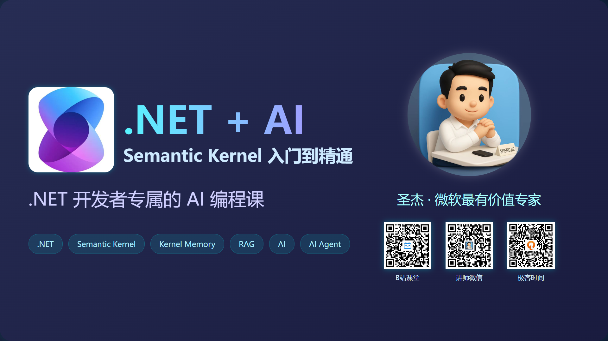
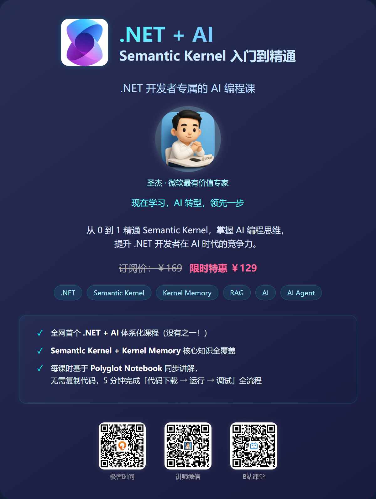

# .NET + AI 基础入门

.NET + AI 基础入门课程，涵盖Semantic Kernel和Kernel Memory基础知识，提供视频讲解和配套Polyglot NoteBook 笔记，方便快速学习。

[.NET+AI 基础入门视频课程](https://www.bilibili.com/video/BV1ELQ6Y2E47)

同时诚邀扫描大家加入【.NET+AI】腾讯频道，该频道将共享.NET上优质资源资讯。点击 [.NET+AI](https://pd.qq.com/s/60je4hsvi?b=9) 即可加入腾讯频道。

也可扫描下方介绍的微信二维码，加入.NET AI 学习沟通群。

## Semantic Kernel
1. [环境搭建及配置](SemanticKernel/00-sk-env-setup.ipynb)
2. [AI 英语老师实现](SemanticKernel/01-sk-ai-english-teacher.ipynb)
3. [SK与智谱AI集成](SemanticKernel/02-1-sk-with-zhipu.ipynb)
4. [SK与DeepSeek AI集成](SemanticKernel/02-2-sk-with-deepseek.ipynb)
5. [SK与OneAPI集成](SemanticKernel/03-sk-with-oneapi.ipynb)
6. [SK与多AI模型集成](SemanticKernel/04-sk-with-multiple-ai.ipynb)
7. [SK的依赖注入](SemanticKernel/05-sk-dependency-injection.ipynb)
8. [SK中的日志记录](SemanticKernel/06-sk-logging.ipynb)
9. [什么是MCP](SemanticKernel/sk-mcp-01-what's-mcp.ipynb)
10. [使用Ollama 本地运行DeepSeek大模型](SemanticKernel/sk-more-01-ollama.ipynb)

## Kernel Memory
1. [什么是Kernel Memory](KernelMemory/00-what's-kernel-memory.ipynb)
2. [KM快速入门](KernelMemory/01-km-quick-start.ipynb)
3. [KM的摄取与检索](KernelMemory/02-km-ingestion-retrieval.ipynb)
4. [KM的管道](KernelMemory/03-km-pipeline.ipynb)

> 如不满足于基础入门，需要更深入学习，可购买我精心打磨和录制的课程：《.NET + AI | Semantic Kernel 入门到精通》。目前该课程已上线极客时间和B站课堂。 

# 进阶课程

👇👇👇直达链接👇👇👇

[B 站课堂](https://www.bilibili.com/cheese/play/ss817794768)

[极客时间](https://time.geekbang.org/course/intro/101031701)

## 课程特色
1️⃣ 全网首个.NET+AI体系化课程（没有之一！）

2️⃣ Semantic Kernel + Kernel Memory 核心知识全覆盖

3️⃣ 每课时基于Polyglot Notebook 同步讲解，无需复制代码，5分钟完成『代码下载→运行→调试』全流程。

## 课程缘由

从去年开始，随着人工智能技术的迅猛发展，我逐渐将关注点从.NET 云原生转向了AI领域。得益于公司的支持，我有幸带领团队率先基于微软推出的AI开发框架Semantic Kernel，开展了一些AI应用的实践探索，并积累了丰富且宝贵的实战经验。这些经验让我深刻意识到，.NET技术在AI时代拥有巨大的潜力。**为了打破 搞AI 还是得Python 的固有观念，让更对的.NET 开发者率先体验 AI 时代的红利**，因此决定为.NET开发者打造一门专属AI课程。

## 为什么上线极客时间
《面向 AI 编程 | Semantic Kernel 从入门到精通》课程上线 B 站课堂已一月有余，*承蒙大家厚爱，课程已售几百份，从中可见.NET 开发者对 AI 转型的迫切需求*。也期望有更多的开发者加入学习探索，在 AI 时代快速迭代，领先一步。

从刚上线的30节课时，到目前更新到50课时，课程体系在不断完善，也同时在推陈出新。对于大家反馈不好的课时予以重录，对于大家期望加入的内容予以录制，比如课程最初并未规划 `Kernel Memory` 相关课时，但在大家的反馈中，为了补全 SK 在`RAG` 应用的短板，又补录了 9 个课时介绍 KM 的运用。 

课程同时紧跟 AI 趋势，设置了`MCP | 模型上下文协议` 章节，用于介绍如何在项目中集成 `MCP`。

B 站作为一个长视频网站，聚集了一大批优秀的Up主，内容涉及广泛，娱乐和专业并重。极客时间作为专注于开发者教育的头部垂直平台，有精准的技术圈层，有更好的学习体验。二者相比， B 站入驻相对简单，极客时间需要严格的审批。也正是因为前期的课程打磨，最终经过一月有余，通过了极客时间的入驻申请。课程上架后，**本课程成为继肖老师『.NET Core 开发实战』后极客时间上第二门.NET体系课程**。

当然，*两个平台的课程将保持同步，大家可以按需选择平台购买。*

👇👇码上购买，AI 转型快人一步👇👇

课程已更新50课时，但尚未完结，将继续打磨完善，保持更新，**力争打造一门实用、易懂、有温度有深度的AI 课程**，助力 .NET 开发者可以在人工智能时代找到属于自己的技术阵地，成功转型。

## 课程简介

### 课程结构
1. 基础篇（章节1-3）：从环境配置到核心功能，夯实开发基础。
2. 进阶篇（章节 4-8）：深入Agent框架、RAG增强、Process工作流、 MCP，解锁复杂场景开发。
3. 实战篇（章节 9）：通过实际案例，串联全流程技术栈，还原真实开发场景。
4. 扩展篇（附录）：覆盖国产模型适配、本地化部署、安全防护等企业级需求，紧跟技术演进。

### 课程亮点
1. 无需担心环境问题，只需安装.NET9 + VS Code + Polyglot Notebook 插件，即可快速上手
2. 从理论到实践，每课时提供交互式 Polyglot Notebook，下载即可执行，无需 Copy 代码
3. 学完课程立即拥有一个自己专项的 Semantic Kernel 知识库，随用随查
4. 免费提供Azure OpenAI API Key，供课程配套学习使用
5. 课程内容持续更新，确保同步 Semantic Kernel 更新内容

## 你将获得
🌟 核心技能： 
1. 掌握 Prompt工程，灵活运用多模板引擎优化大模型交互效果。
2. 掌握Semantic Kernel框架的核心模块，熟练开发AI插件、智能体（Agent）、RAG检索增强应用。
3. 实现多模型混合调用、函数调用（Function Calling）行为控制与日志追踪。
4. 构建AI工作流（Process Framework），完成条件控制、步骤复用与多Agent协同。
 
🔧 实战能力： 
1. 对接国内大模型及本地化部署（如Ollama），突破技术限制。
2. 开发企业级AI应用，集成日志、安全、依赖注入等工程化能力。
3. 通过将已有 OpenAPI快速转换为插件，扩展LLM能力边界。
 
🚀 前沿视野： 
1. 深入理解AI Agent设计理念与协作模式，掌握AgentChat等前沿技术。 
2. 解锁语义搜索（Qdrant）、文本搜索（Bing）在RAG中的实战应用。 
3. 探索Microsoft.Extensions.AI统一基座与MCP（Model Context Protocol，模型上下文） 协议，把握行业趋势。

# 诚邀学习

1. 从企业应用现状来看，AI能力正在从「加分项」转变为「必备项」。AI 转型迫在眉睫， 掌握Semantic Kernel能够极⼤提升.NET开发者在AI时代的竞争⼒，拓展职业发展空间，获得更多职场机遇。 
2. 机会都是留给有准备之人，掌握SK 核心技能，了解AI应用开发集成流程。从而有信心推动现有业务与 AI 的集成或新型业务的创新。

因此，诚邀.NET 同行，扫码下图二维码加入学习，共同在AI 时代，打一份天地。

